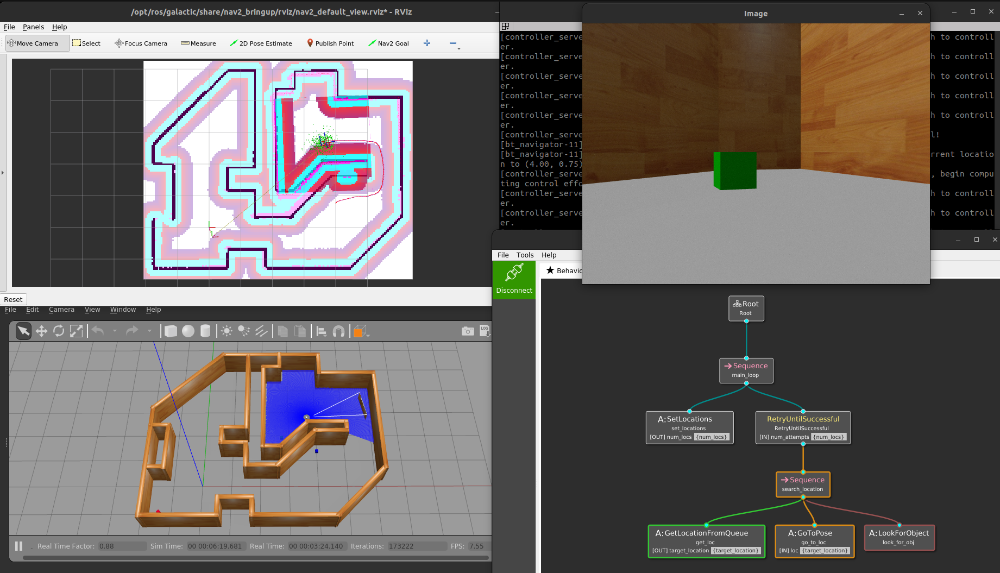

# TurtleBot3 Autonomy on Humble - ROS Docker Example

- Based on [TurtleBot3 ROS Docker](https://github.com/BardiaMojra/turtlebot3_ros_docker)

The autonomy in these examples are designed using **behavior trees**. For more information, refer to [this blog post](https://roboticseabass.com/2021/05/08/introduction-to-behavior-trees/) or the [Behavior Trees in Robotics and AI textbook](https://arxiv.org/abs/1709.00084).

This also serves as an example for Docker workflows in ROS based projects. For more information, refer to [this blog post](https://roboticseabass.com/2021/04/21/docker-and-ros/).

If you want to use ROS 1, check out the old version of this example from the [`noetic`](https://github.com/sea-bass/turtlebot3_behavior_demos/tree/noetic) branch of this repository.

By Sebastian Castro, 2021-2023

---

## File/Directory Description

- docker: where dockerfiles, build, and entrypoint scrips reside.
- media: where readme photos reside
- packages
- .env: declare default env variables for docker compose file
- dependencies.repos: file where git repo dependencies are declared
- docker-compose.yaml: all docker build and run instructions reside

## Setup

### Docker Setup (Recommended)

First, install Docker and Docker Compose using [the official install guide](https://docs.docker.com/engine/install/ubuntu/).

To run Docker containers with graphics and GPU support, you will also need the [NVIDIA Container Toolkit](https://github.com/NVIDIA/nvidia-docker).

To use GUI based tools (e.g., RViz, Gazebo) inside Docker, there is additional setup required. The simplest way is to run the command below each time you log into your machine, but there is a more detailed walkthrough of options in the [ROS Wiki](http://wiki.ros.org/docker/Tutorials/GUI).

```
xhost + local:docker
```

First, clone this repository and go into the top-level folder:

```
git clone https://github.com/sea-bass/turtlebot3_behavior_demos.git
cd turtlebot3_behavior_demos
```

Build the Docker images. This will take a while and requires approximately 5 GB of disk space.

```
docker compose build
```

### Local Setup

If you do not want to use Docker, you can directly clone this package to a Colcon workspace and build it provided you have the necessary dependencies. As long as you can run the examples in the [TurtleBot3 manual](https://emanual.robotis.com/docs/en/platform/turtlebot3/overview/#overview), you should be in good shape.

First, make a Colcon workspace and clone this repo there:

```
mkdir -p turtlebot3_ws/src
cd turtlebot3_ws/src
git clone https://github.com/sea-bass/turtlebot3_behavior_demos.git
```

Clone the external dependencies:

```
sudo apt-get install python3-vcstool
vcs import < turtlebot3_behavior_demos/dependencies.repos
```

Set up any additional dependencies using rosdep:

```
sudo apt update && rosdep install -r --from-paths . --ignore-src --rosdistro $ROS_DISTRO -y
```

Then, build the workspace.

```
cd turtlebot3_ws
colcon build
```

---

## Basic Usage

We use [Docker Compose](https://docs.docker.com/compose/) to automate building, as shown above, but also for various useful entry points into the Docker container once it has been built. **All `docker compose` commands below should be run from your host machine, and not from inside the container**.

To enter a Terminal in the overlay container, first start a container:

```
docker compose up overlay
```

Then, in a separate Terminal, you can access the running container:

```
docker exec -it turtlebot3_behavior_demos-overlay-1 bash
```

You can verify that display in Docker works by starting a basic Gazebo simulation included in the standard TurtleBot3 packages:

```
docker compose up sim
```

---

## Behavior Trees Demo

In this example, the robot navigates around known locations with the goal of finding a block of a specified color (red, green, or blue). Object detection is done using simple thresholding in the [HSV color space](https://en.wikipedia.org/wiki/HSL_and_HSV) with calibrated values.

To start the demo world, run the following command:

```
docker compose up demo-world
```

### Behavior Trees in Python

To start the Python based demo, which uses [`py_trees`](https://py-trees.readthedocs.io/en/devel/):

```
docker compose up demo-behavior-py
```

You can also change the following environment variables to set arguments for the launch files, or by modifying the defaults in the `.env` file:

```
TARGET_COLOR=green BT_TYPE=queue ENABLE_VISION=true docker compose up demo-behavior-py
```

Note that the behavior tree viewer ([`py_trees_ros_viewer`](https://github.com/splintered-reality/py_trees_ros_viewer)) should automatically discover the ROS node containing the behavior tree and visualize it.

After starting the commands above (plus doing some waiting and window rearranging), you should see the following. The labeled images will appear once the robot reaches a target location.


### Behavior Trees in C++

To start the C++ demo, which uses [`BehaviorTree.CPP`](https://www.behaviortree.dev/):

```
docker compose up demo-behavior-cpp
```

You can also change the following environment variables to set arguments for the launch files, or by modifying the defaults in the `.env` file:

```
TARGET_COLOR=green BT_TYPE=queue ENABLE_VISION=true docker compose up demo-behavior-cpp
```

This example uses the behavior tree viewer ([`Groot`](https://github.com/BehaviorTree/Groot)).
Since the TurtleBot3 navigation stack uses its own behavior trees on the default ports (1666 and 1667), we use ports 1668 and 1669 for this demo.
You can change the ports in the UI to view the navigation behavior trees instead, though.

After starting the commands above (plus doing some waiting and window rearranging), you should see the following. The labeled images will appear once the robot reaches a target location.


